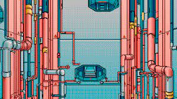

# pipe
## This project will let discover in detail a UNIX mechanism.

_**This is a 21 School project**_



_Pipex is a project that reproduces the behaviour of **the shell pipe |** command in C._

---

Program will be executed as follows:

```bash
$> ./pipex file1 cmd1 cmd2 file2
```

and behave as this line does in the shell:

```bash
$> < file1 cmd1 | cmd2 > file2
```
 
It must take 4 arguments:
 
• file1 and file2 are file names.
 
• cmd1 and cmd2 are shell commands with their parameters.
  
> The general idea: we read from infile, execute cmd1 with infile as input, send the output to cmd2, which will write to outfile.
---
## Multiple pipes and `here_doc`

### Multiple pipes
_Program need handle multiple pipes._

Handle multiple pipes. Program will be executed as follows:

```bash
$> ./pipex file1 cmd1 cmd2 cmd3 ... cmdn file2
```

and behave as this line does in the shell:

```bash
$> < file1 cmd1 | cmd2 | cmd3 | ... | cmdn > file2
```

### `here_doc`

Support `<<` and `>>` when the _first parameter_ is `here_doc`

_This:_
```bash
$> ./pipex here_doc LIMITER cmd cmd1 file
```

_should behave like:_
```bash
cmd << LIMITER | cmd1 >> file
```
